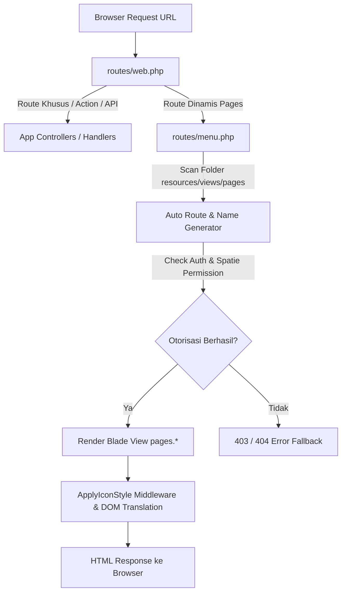

# Veltronic — Enterprise Laravel 13 & Metronic 8.3.2 Admin Template

<div align="center">


<p align="center">
  <strong>Template Admin Dashboard Enterprise Berkinerja Tinggi Berbasis Laravel 13 dan KeenThemes Metronic 8.3.2</strong><br>
  Dilengkapi arsitektur modular, live bilingual tanpa refresh, hotkeys global, smart backup berelasi, audit logging terpusat, dan standar zero-reload AJAX CRUD.
</p>

[Repositori GitHub](https://github.com/AbdoelMadjid/veltronic-template.git) • [Skema Pemrograman](#indeks-skema-pemrograman--dokumentasi-pengembang) • [Panduan Instalasi](#panduan-instalasi-langkah-demi-langkah) • [Pintasan Keyboard](#sistem-pintasan-keyboard-global-hotkeys)

---

</div>

## Daftar Isi

- [Fitur Unggulan & Arsitektur Sistem](#fitur-unggulan--arsitektur-sistem)
- [Persyaratan Sistem (System Requirements)](#persyaratan-sistem-system-requirements)
- [Panduan Instalasi Langkah-demi-Langkah](#panduan-instalasi-langkah-demi-langkah)
  - [1. Clone Repositori](#1-clone-repositori)
  - [2. Install Dependensi](#2-install-dependensi)
  - [3. Konfigurasi Environment](#3-konfigurasi-environment)
  - [4. Konfigurasi Database & Migrasi](#4-konfigurasi-database--migrasi)
  - [5. Menjalankan Server Development](#5-menjalankan-server-development)
  - [Opsi Otomatisasi (Setup Cepat & All-in-One Dev)](#opsi-otomatisasi-setup-cepat--all-in-one-dev)
- [Kredensial Akun Default (Development)](#kredensial-akun-default-development)
- [Sistem Pintasan Keyboard Global (Hotkeys)](#sistem-pintasan-keyboard-global-hotkeys)
- [Arsitektur Alur Kerja & Routing Dinamis](#arsitektur-alur-kerja--routing-dinamis)
- [Struktur Direktori Proyek](#struktur-direktori-proyek)
- [Indeks Skema Pemrograman & Dokumentasi Pengembang](#indeks-skema-pemrograman--dokumentasi-pengembang)
  - [Kelompok 1: Skema Arsitektur (21 Topik)](#kelompok-1-skema-arsitektur-21-topik)
  - [Kelompok 2: Panduan Operasional & Developer Playbook (13 Topik)](#kelompok-2-panduan-operasional--developer-playbook-13-topik)
- [Panduan Deployment Production](#panduan-deployment-production)
- [Pembuat & Pengembang](#pembuat--pengembang)
- [Lisensi](#lisensi)

---

## Fitur Unggulan & Arsitektur Sistem

Veltronic dirancang dengan fokus pada skalabilitas enterprise, isolasi modular, dan pengalaman pengguna (UX) yang sangat mulus:

1. 🌐 **Live Realtime Bilingual Engine (EN / ID)**
   Pergantian bahasa instan tanpa me-reload halaman menggunakan arsitektur DOM TreeWalker traversal (`language.js`), caching payload terdistribusi, dan sinkronisasi sesi Laravel di latar belakang.
2. ⌨️ **Global Keyboard Shortcuts Hub (Action Registry)**
   Sistem pintasan keyboard bebas konflik peramban (`Ctrl+Alt+[Key]`) berbasis basis data (`app_shortcuts`), dilengkapi deteksi tabrakan tombol seketika (*realtime collision warning*) dan otorisasi peran.
3. 🛡️ **Centralized Audit Logging & Error Tracking**
   Perekaman audit mutasi data lintas modul (`users_logs`), pelacakan switcher topbar otomatis, riwayat reward poin login 24-jam & sesi layar kunci (`users_logins`), serta penangkap exception backend otomatis.
4. 💾 **Smart Relational Database Backup & Restore Engine**
   Pencadangan basis data cerdas dengan inspeksi dependensi Foreign Key otomatis, kompresi streaming Gzip, preview skema tabel & baris data live, scheduler otomatis, serta pencatatan audit pelaksana cadangan.
5. ⚙️ **App Profile & Dynamic SEO Engine**
   Manajemen identitas aplikasi dinamis berbasis basis data (`app_profiles`), validasi ketat rasio logo (terang, gelap, mini) dan favicon, link footer dinamis, serta live preview Google Search snippet & Open Graph social card.
6. ⚡ **Zero-Reload Realtime CRUD & Button Feedback Standards**
   Standar CRUD berbasis AJAX mutlak tanpa refresh halaman dengan pembaruan UI instan dan animasi tombol loading spinner (`data-kt-indicator="on"`) anti double-click.
7. 🎨 **Multi-Theme Version Resolver (Layout V1 & V2)**
   Resolusi variasi tata letak layout dinamis dengan sinkronisasi mode tema Gelap/Terang (*Dark/Light Mode*) terpusat.
8. 💎 **Zero-Flicker KeenIcons Style Engine**
   Normalisasi kelas ikon KeenIcons langsung dari server-side middleware (`ApplyIconStyle`) sesuai preferensi pengguna (Duotone, Solid, Outline) tanpa kedipan (FOIT/flicker) saat muat halaman.
9. 🔀 **Dynamic Menu Management & Auto Route Generator**
   Pemetaan otomatis file Blade di `resources/views/pages` menjadi route URL dan route name internal, terintegrasi dengan konfigurasi menu hierarkis dan otorisasi hak akses Spatie Permission.
10. 📖 **Komponen Petunjuk Operasional Terpadu (`<x-petunjuk-modal>`)**
    Standarisasi modal petunjuk operasional modular 4-kotak terstruktur (Gambaran Umum, Hirarki/Komponen, Alur Operasional, Proteksi Sistem) pada setiap modul sistem.

---

## Persyaratan Sistem (System Requirements)

Sebelum memulai, pastikan server atau workstation development Anda telah memenuhi spesifikasi berikut:

| Perangkat Lunak / Runtime | Versi Minimum | Keterangan |
| :--- | :--- | :--- |
| **PHP** | `>= 8.2` | Direkomendasikan PHP 8.3+ (Ekstensi: `pdo_mysql`, `mbstring`, `openssl`, `curl`, `zip`, `zlib`, `gd`/`imagick`) |
| **Composer** | `>= 2.x` | Pengelola paket dependensi backend PHP |
| **Node.js** | `>= 18.x` | Runtime JavaScript untuk kompilasi asset frontend (disarankan LTS 20+) |
| **NPM** | `>= 9.x` | Pengelola paket frontend |
| **Basis Data** | MySQL `8.0+` / MariaDB `10.4+` | Didukung juga SQLite untuk testing isolation |
| **Web Server** | Nginx / Apache / Laragon / Sail | Virtual host diarahkan ke root folder `/public` |

---

## Panduan Instalasi Langkah-demi-Langkah

### 1. Clone Repositori

```bash
git clone https://github.com/AbdoelMadjid/veltronic-template.git
cd veltronic-template
```

### 2. Install Dependensi

Install dependensi backend (PHP) dan frontend (Node.js):

```bash
composer install
npm install
```

### 3. Konfigurasi Environment

Salin berkas konfigurasi template `.env.example` menjadi `.env`:

```bash
# Linux / macOS / Git Bash
cp .env.example .env

# Windows PowerShell
Copy-Item .env.example .env
```

Generate application encryption key:

```bash
php artisan key:generate
```

### 4. Konfigurasi Database & Migrasi

Buka file `.env` dan sesuaikan kredensial koneksi basis data Anda:

```env
DB_CONNECTION=mysql
DB_HOST=127.0.0.1
DB_PORT=3306
DB_DATABASE=veltronic_template
DB_USERNAME=root
DB_PASSWORD=
```

Jalankan migrasi tabel dan seeding data default:

```bash
php artisan migrate --seed
```

> [!TIP]
> Perintah `--seed` akan secara otomatis mengeksekusi seeder peran (*Roles*), izin (*Permissions*), pengguna demo (*Users*), profil aplikasi (*App Profile*), serta 13 pintasan keyboard bawaan (*Shortcuts*).

### 5. Menjalankan Server Development

Jalankan backend server Laravel:

```bash
php artisan serve
```

Jalankan Vite asset bundler di jendela terminal terpisah:

```bash
npm run dev
```

Buka peramban dan akses: **`http://127.0.0.1:8000`**

---

### Opsi Otomatisasi (Setup Cepat & All-in-One Dev)

Tersedia skrip Composer bawaan untuk mempermudah workflow development:

- **Setup Otomatis Sekali Jalan:**
  ```bash
  composer run setup
  ```
  *(Otomatis install vendor, generate `.env`, buat app key, migrate DB, install node_modules, dan build asset)*

- **Menjalankan Seluruh Service Development Sekaligus:**
  ```bash
  composer run dev
  ```
  *(Menjalankan `php artisan serve`, queue worker, `laravel pail` live logger, dan `npm run dev` secara paralel)*

---

## Kredensial Akun Default (Development)

Setelah database berhasil di-seed, gunakan akun berikut untuk masuk ke sistem:

| Peran (Role) | Email | Password | Hak Akses Utama |
| :--- | :--- | :--- | :--- |
| **Super Admin / Master** | `test@example.com` | `password` | Akses penuh seluruh modul (User Management, App Support, Database Backup, Menu, dll.) |

> [!NOTE]
> Setelah login, Anda dapat mengelola data profil, mengganti avatar, melihat audit log, atau menambahkan pengguna baru pada menu **Manajemen Pengguna**.

---

## Sistem Pintasan Keyboard Global (Hotkeys)

Veltronic dilengkapi sistem pintasan keyboard terstandarisasi dengan kombinasi `Ctrl + Alt + [Key]` yang kebal terhadap konflik tombol fungsi bawaan browser:

| Kombinasi Tombol | Kategori | Aksi yang Dijalankan |
| :--- | :--- | :--- |
| <kbd>Ctrl</kbd> + <kbd>Alt</kbd> + <kbd>T</kbd> | Visibilitas | Toggle Bilah Tools Navigasi Atas (*Topbar Navbar Tools*) |
| <kbd>Ctrl</kbd> + <kbd>Alt</kbd> + <kbd>H</kbd> | Visibilitas | Toggle Menu Tajuk Header (*Header Menu Links*) |
| <kbd>Ctrl</kbd> + <kbd>Alt</kbd> + <kbd>M</kbd> | Visibilitas | Toggle Menu Bilah Samping (*Sidebar Menu Template*) |
| <kbd>Ctrl</kbd> + <kbd>Alt</kbd> + <kbd>B</kbd> | Tampilan | Beralih Cepat Mode Tema (*Dark Mode / Light Mode*) |
| <kbd>Ctrl</kbd> + <kbd>Alt</kbd> + <kbd>D</kbd> | Tampilan | Ganti Gaya Ikon ke **Duotone** |
| <kbd>Ctrl</kbd> + <kbd>Alt</kbd> + <kbd>S</kbd> | Tampilan | Ganti Gaya Ikon ke **Solid** |
| <kbd>Ctrl</kbd> + <kbd>Alt</kbd> + <kbd>O</kbd> | Tampilan | Ganti Gaya Ikon ke **Outline** |
| <kbd>Ctrl</kbd> + <kbd>Alt</kbd> + <kbd>I</kbd> | Tampilan | Beralih Bahasa ke **Bahasa Indonesia** |
| <kbd>Ctrl</kbd> + <kbd>Alt</kbd> + <kbd>E</kbd> | Tampilan | Beralih Bahasa ke **English** |
| <kbd>Ctrl</kbd> + <kbd>Alt</kbd> + <kbd>1</kbd> | Tampilan | Beralih ke Tata Letak **Layout V1** |
| <kbd>Ctrl</kbd> + <kbd>Alt</kbd> + <kbd>2</kbd> | Tampilan | Beralih ke Tata Letak **Layout V2** |
| <kbd>Ctrl</kbd> + <kbd>Alt</kbd> + <kbd>F</kbd> | Sistem | Buka Modal Pencarian Pengguna Global (*Quick Search*) |
| <kbd>Ctrl</kbd> + <kbd>Alt</kbd> + <kbd>L</kbd> | Sistem | Kunci Layar Instan (*Lock Screen Session*) |

Pintasan baru dapat ditambahkan, diubah kombinasinya, atau dibatasi perannya melalui menu **Pendukung Aplikasi > Pintasan Keyboard** (`/appsupport/app-shortcuts`).

---

## Arsitektur Alur Kerja & Routing Dinamis

Aplikasi menggunakan perpaduan rute standar dan **Auto-Routing Engine** untuk view yang terletak di `resources/views/pages`:



### Konvensi Auto-Mapping URL & Route Name:
```text
File Blade: resources/views/pages/usermanagement/users.blade.php
├── URL Path   : /usermanagement/users
├── Route Name : usermanagement.users
└── View Name  : pages.usermanagement.users
```

---

## Struktur Direktori Proyek

```text
veltronic-template/
├── app/
│   ├── Http/
│   │   ├── Controllers/       # Controller aksi CRUD dan backend logic
│   │   └── Middleware/        # ApplyIconStyle, SetLocale, Auth, dll.
│   ├── Models/
│   │   ├── AppSupport/        # AppSetting, AppProfile, AppShortcut
│   │   ├── Profil/            # UserLog (Audit Log), UserLogin
│   │   └── User.php           # User model dengan Spatie Permission & Points
│   └── Support/               # LanguageManager, ThemeAsset, ThemeVersion, Frontpage
├── config/
│   ├── header/                # Konfigurasi menu header topbar
│   ├── sidebar/               # Konfigurasi menu navigasi sidebar per modul
│   └── _modals.php            # Pendaftaran modal global sistem
├── docs/                      # Dokumentasi teknis & skema pemrograman (34 Dokumen Markdown)
├── lang/
│   ├── en/                    # Kamus translasi Bahasa Inggris
│   └── id/                    # Kamus translasi Bahasa Indonesia
├── public/
│   └── assets/                # Asset tema Metronic (CSS, JS, Media, Flags, Logos)
├── resources/
│   ├── js/                    # Sumber file JS Vite
│   └── views/
│       ├── components/        # Blade components reusable (<x-petunjuk-modal>, dll.)
│       ├── frontpages/        # Varian landing page dan frontpage
│       ├── layouts/           # Master layout V1 & V2, partials header, toolbar, sidebar
│       ├── pages/             # Seluruh halaman modul (Dashboard, User Management, App Support, Help)
│       └── partials/          # Modal global, drawer, notifikasi, lock screen
└── routes/
    ├── admin.php              # Rute aksi administratif
    ├── auth.php               # Rute autentikasi Breeze / custom
    ├── menu.php               # Auto-routing generator halaman pages
    └── web.php                # Rute utama, switcher tema, switcher bahasa, profile
```

---

## Indeks Skema Pemrograman & Dokumentasi Pengembang

Sistem Veltronic dilengkapi portal dokumentasi bawaan sebanyak **34 topik komprehensif** yang dapat diakses langsung dari menu **Help > Skema Pemrograman** (`/help/pemrograman/overview`) atau via berkas Markdown di direktori [`docs/skema-pemrograman/`](./docs/skema-pemrograman/README.md).

### Kelompok 1: Skema Arsitektur (21 Topik)

| No | Modul Skema | Deskripsi Arsitektur | URL Internal | Dokumentasi File |
| :---: | :--- | :--- | :--- | :--- |
| **01** | **Skema Route** | Pemetaan otomatis file Blade di folder `pages` ke rute URL. | `/help/pemrograman/skema/route` | [`route.md`](./docs/skema-pemrograman/skema/route.md) |
| **02** | **Skema Layout** | Struktur shell layout global, header, sidebar, dan container konten. | `/help/pemrograman/skema/layout` | [`layout.md`](./docs/skema-pemrograman/skema/layout.md) |
| **03** | **Skema Komponen & Partial** | Standarisasi reusable Blade components & partials modul. | `/help/pemrograman/skema/komponen-blade-partial` | [`komponen-blade-partial.md`](./docs/skema-pemrograman/skema/komponen-blade-partial.md) |
| **04** | **Skema Theme Assets** | Resolver bundle asset Metronic, path CDN, dan isolasi versi tema. | `/help/pemrograman/skema/theme-assets` | [`theme-assets.md`](./docs/skema-pemrograman/skema/theme-assets.md) |
| **05** | **Skema Auth & Middleware** | Matriks Spatie Permission, otorisasi peran, & proteksi rute. | `/help/pemrograman/skema/auth-dan-middleware` | [`auth-dan-middleware.md`](./docs/skema-pemrograman/skema/auth-dan-middleware.md) |
| **06** | **Skema Struktur Config Menu** | Format array definisi menu sidebar dan header topbar. | `/help/pemrograman/skema/struktur-config-menu` | [`struktur-config-menu.md`](./docs/skema-pemrograman/skema/struktur-config-menu.md) |
| **07** | **Skema Sidebar Menu** | Rendering menu bilah samping hirarkis multi-level & active state. | `/help/pemrograman/skema/sidebar-menu` | [`sidebar-menu.md`](./docs/skema-pemrograman/skema/sidebar-menu.md) |
| **08** | **Skema Header Menu** | Pola navigasi menu tajuk untuk tautan internal dan eksternal. | `/help/pemrograman/skema/header-menu` | [`header-menu.md`](./docs/skema-pemrograman/skema/header-menu.md) |
| **09** | **Skema Data Layer** | Pemisahan Model Eloquent, Query Scope, dan DB Transaction. | `/help/pemrograman/skema/data-layer` | [`data-layer.md`](./docs/skema-pemrograman/skema/data-layer.md) |
| **10** | **Skema Error & Fallback** | Penanganan exception otomatis, error 404, dan fallback graceful. | `/help/pemrograman/skema/error-handling-dan-fallback` | [`error-handling-dan-fallback.md`](./docs/skema-pemrograman/skema/error-handling-dan-fallback.md) |
| **11** | **Skema Cache & Deployment** | Kebijakan caching konfigurasi, view, dan urutan zero-downtime deploy. | `/help/pemrograman/skema/cache-dan-deployment` | [`cache-dan-deployment.md`](./docs/skema-pemrograman/skema/cache-dan-deployment.md) |
| **12** | **Skema Pemilihan Bahasa** | Arsitektur engine translasi realtime zero-reload (KTLanguage). | `/help/pemrograman/skema/pemilihan-bahasa` | [`pemilihan-bahasa.md`](./docs/skema-pemrograman/skema/pemilihan-bahasa.md) |
| **13** | **Skema i18n Lanjutan** | Konvensi penamaan kunci dwibahasa, fallback, & text mapper. | `/help/pemrograman/skema/i18n-lanjutan` | [`i18n-lanjutan.md`](./docs/skema-pemrograman/skema/i18n-lanjutan.md) |
| **14** | **Skema Versi Tampilan** | Multi-version layout resolver (V1 & V2) dan theme switcher. | `/help/pemrograman/skema/pergantian-versi-tampilan` | [`pergantian-versi-tampilan.md`](./docs/skema-pemrograman/skema/pergantian-versi-tampilan.md) |
| **15** | **Skema Pergantian Frontpage** | Dynamic frontpage loader dan pemilihan landing page root. | `/help/pemrograman/skema/pergantian-frontpage` | [`pergantian-frontpage.md`](./docs/skema-pemrograman/skema/pergantian-frontpage.md) |
| **16** | **Skema Pergantian Icon** | Zero-flicker middleware rendering engine gaya KeenIcons. | `/help/pemrograman/skema/pergantian-icon` | [`pergantian-icon.md`](./docs/skema-pemrograman/skema/pergantian-icon.md) |
| **17** | **Skema Title & Breadcrumb** | Dinamisasi judul tab browser, breadcrumb trail, dan schema SEO. | `/help/pemrograman/skema/page-title-dan-breadcrumbs` | [`page-title-dan-breadcrumbs.md`](./docs/skema-pemrograman/skema/page-title-dan-breadcrumbs.md) |
| **18** | **Skema Keyboard Shortcuts** | Blueprint hotkeys global, action registry, & deteksi tabrakan. | `/help/pemrograman/skema/keyboard-shortcuts` | [`keyboard-shortcuts.md`](./docs/skema-pemrograman/skema/keyboard-shortcuts.md) |
| **19** | **Skema Audit Log & Error** | Log aktivitas sentral `users_logs`, filter level, dan error catcher. | `/help/pemrograman/skema/audit-log-dan-error-tracking` | [`audit-log-dan-error-tracking.md`](./docs/skema-pemrograman/skema/audit-log-dan-error-tracking.md) |
| **20** | **Skema DB Backup & Relasi** | Backup relasional cerdas deteksi dependensi FK & Gzip streaming. | `/help/pemrograman/skema/database-backup-dan-relasi-tabel` | [`database-backup-dan-relasi-tabel.md`](./docs/skema-pemrograman/skema/database-backup-dan-relasi-tabel.md) |
| **21** | **Skema Profil & Avatar Studio** | Manajemen profil, avatar fokus atas (50% 0%), & data login. | `/help/pemrograman/skema/profil-pengguna-dan-avatar-studio` | [`profil-pengguna-dan-avatar-studio.md`](./docs/skema-pemrograman/skema/profil-pengguna-dan-avatar-studio.md) |

---

### Kelompok 2: Panduan Operasional & Developer Playbook (13 Topik)

| No | Modul Panduan | Ruang Lingkup Petunjuk Praktis | URL Internal | Dokumentasi File |
| :---: | :--- | :--- | :--- | :--- |
| **01** | **Panduan Tambah Halaman** | Prosedur pembuatan halaman baru end-to-end hingga registrasi menu. | `/help/pemrograman/operasional/panduan-tambah-halaman` | [`panduan-tambah-halaman.md`](./docs/skema-pemrograman/operasional/panduan-tambah-halaman.md) |
| **02** | **Panduan Tambah Menu** | Standar menambahkan item menu di config sidebar dan header topbar. | `/help/pemrograman/operasional/panduan-tambah-menu` | [`panduan-tambah-menu.md`](./docs/skema-pemrograman/operasional/panduan-tambah-menu.md) |
| **03** | **Panduan Upgrade Metronic** | Panduan upgrade versi library Metronic tanpa merusak logika kustom. | `/help/pemrograman/operasional/panduan-pergantian-versi-metronic` | [`panduan-pergantian-versi-metronic.md`](./docs/skema-pemrograman/operasional/panduan-pergantian-versi-metronic.md) |
| **04** | **Panduan Switch Frontpage** | Langkah memilih frontpage default via UI atau konfigurasi `.env`. | `/help/pemrograman/operasional/panduan-pergantian-frontpage` | [`panduan-pergantian-frontpage.md`](./docs/skema-pemrograman/operasional/panduan-pergantian-frontpage.md) |
| **05** | **Panduan Title & Breadcrumb** | Standardisasi section title, deskripsi modul, dan navigasi hierarki. | `/help/pemrograman/operasional/panduan-page-title-dan-breadcrumbs` | [`panduan-page-title-dan-breadcrumbs.md`](./docs/skema-pemrograman/operasional/panduan-page-title-dan-breadcrumbs.md) |
| **06** | **Konvensi Penamaan** | Standar penamaan file Blade, rute, tabel database, & kunci kamus. | `/help/pemrograman/operasional/konvensi-penamaan` | [`konvensi-penamaan.md`](./docs/skema-pemrograman/operasional/konvensi-penamaan.md) |
| **07** | **Workflow Developer Harian** | Ritme kerja harian: aturan non-destruktif, anti-regresi, & quality gate. | `/help/pemrograman/operasional/workflow-developer-harian` | [`workflow-developer-harian.md`](./docs/skema-pemrograman/operasional/workflow-developer-harian.md) |
| **08** | **Checklist QA Smoke Test** | Daftar uji minimum sebelum rilis untuk memastikan zero-regression. | `/help/pemrograman/operasional/checklist-qa-smoke-test` | [`checklist-qa-smoke-test.md`](./docs/skema-pemrograman/operasional/checklist-qa-smoke-test.md) |
| **09** | **Playbook Incident Response** | Tanggap darurat penanganan insiden bug/down time skala 0–15 menit. | `/help/pemrograman/operasional/playbook-incident-response` | [`playbook-incident-response.md`](./docs/skema-pemrograman/operasional/playbook-incident-response.md) |
| **10** | **Panduan Hotkeys Engine** | Panduan pendaftaran aksi kustom pada `window.VeltronicShortcuts`. | `/help/pemrograman/operasional/panduan-keyboard-shortcuts` | [`panduan-keyboard-shortcuts.md`](./docs/skema-pemrograman/operasional/panduan-keyboard-shortcuts.md) |
| **11** | **Panduan Investigasi Error** | Langkah membaca audit log terpusat dan investigasi exception log. | `/help/pemrograman/operasional/panduan-audit-log-dan-investigasi-error` | [`panduan-audit-log-dan-investigasi-error.md`](./docs/skema-pemrograman/operasional/panduan-audit-log-dan-investigasi-error.md) |
| **12** | **Panduan Backup & Restore** | Prosedur pencadangan parsial/penuh, inspeksi file gzip, dan restore DB. | `/help/pemrograman/operasional/panduan-backup-dan-restore-database` | [`panduan-backup-dan-restore-database.md`](./docs/skema-pemrograman/operasional/panduan-backup-dan-restore-database.md) |
| **13** | **Panduan Zero-Reload CRUD** | Standar penulisan AJAX CRUD, respons JSON, dan button loading indicator. | `/help/pemrograman/operasional/panduan-standar-zero-reload-dan-button-loading` | [`panduan-standar-zero-reload-dan-button-loading.md`](./docs/skema-pemrograman/operasional/panduan-standar-zero-reload-dan-button-loading.md) |

---

## Panduan Deployment Production

Berikut adalah alur standar deployment aplikasi Veltronic ke lingkungan server production:

```bash
# 1. Tarik pembaruan kode dari repositori
git pull origin main

# 2. Install dependensi backend tanpa dev package dengan autoloader teroptimasi
composer install --no-dev --optimize-autoloader

# 3. Install dan kompilasi asset frontend production
npm ci
npm run build

# 4. Eksekusi migrasi database
php artisan migrate --force

# 5. Optimalkan seluruh cache aplikasi Laravel
php artisan optimize:clear
php artisan optimize

# 6. Pastikan symlink storage terpasang
php artisan storage:link
```

### Checklist Wajib Production:
- [x] Pastikan `APP_ENV=production` dan `APP_DEBUG=false` pada berkas `.env`.
- [x] Berikan hak akses tulis (*write permissions*) pada direktori `storage/` dan `bootstrap/cache/` (contoh: `chmod -R 775 storage bootstrap/cache`).
- [x] Konfigurasikan Web Server (Nginx / Apache) agar Document Root mengarah langsung ke folder `/public`.
- [x] Jalankan background Queue Worker menggunakan Supervisor (`php artisan queue:work --tries=3`).
- [x] Tambahkan Cron Job Laravel Scheduler (`* * * * * cd /path/to/project && php artisan schedule:run >> /dev/null 2>&1`).

---

## Pembuat & Pengembang

Aplikasi dan arsitektur template ini dikembangkan dan dirancang oleh:

- **Nama**: Abdoel Madjid
- **Peran**: Full-Stack Developer & Software Architect
- **GitHub**: [@AbdoelMadjid](https://github.com/AbdoelMadjid)
- **Repositori Proyek**: [veltronic-template](https://github.com/AbdoelMadjid/veltronic-template)

---

## Lisensi

Proyek ini dilisensikan di bawah lisensi **[MIT License](LICENSE)**. Anda bebas menggunakan, memodifikasi, dan mendistribusikan template ini untuk kebutuhan personal maupun komersial.
